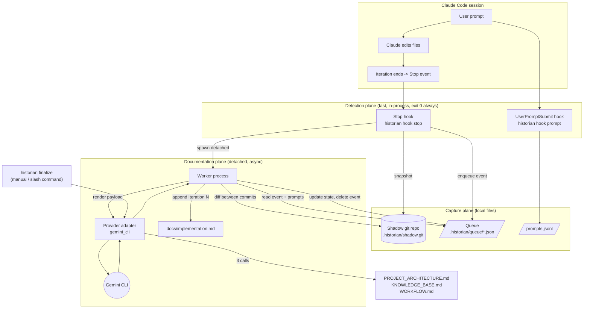
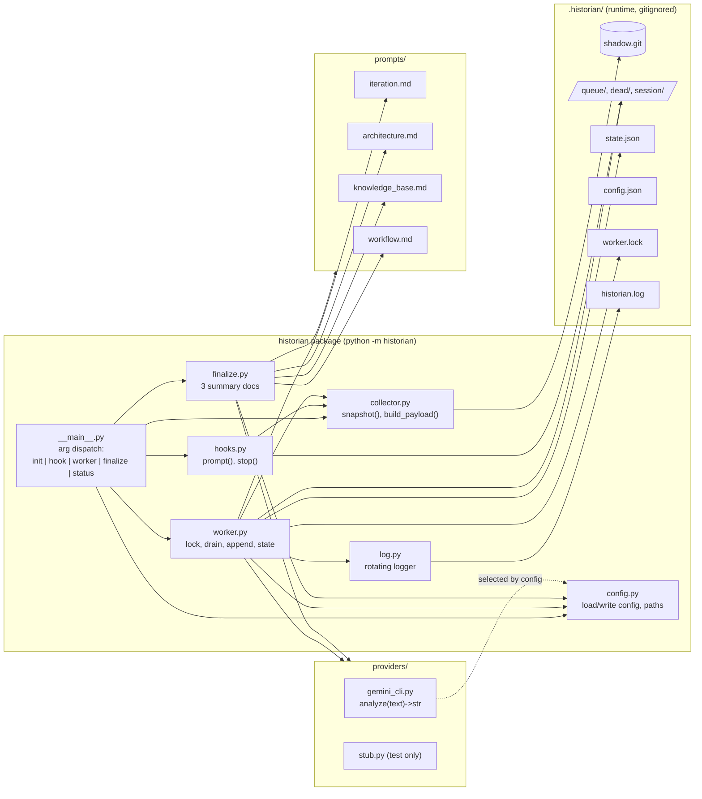
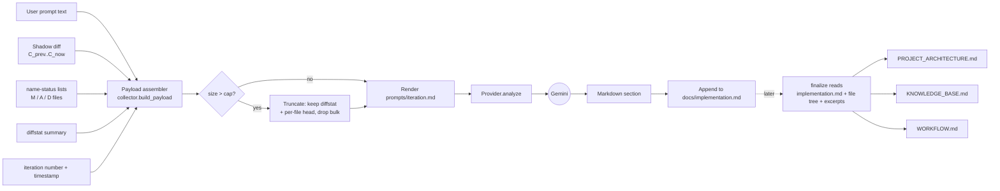
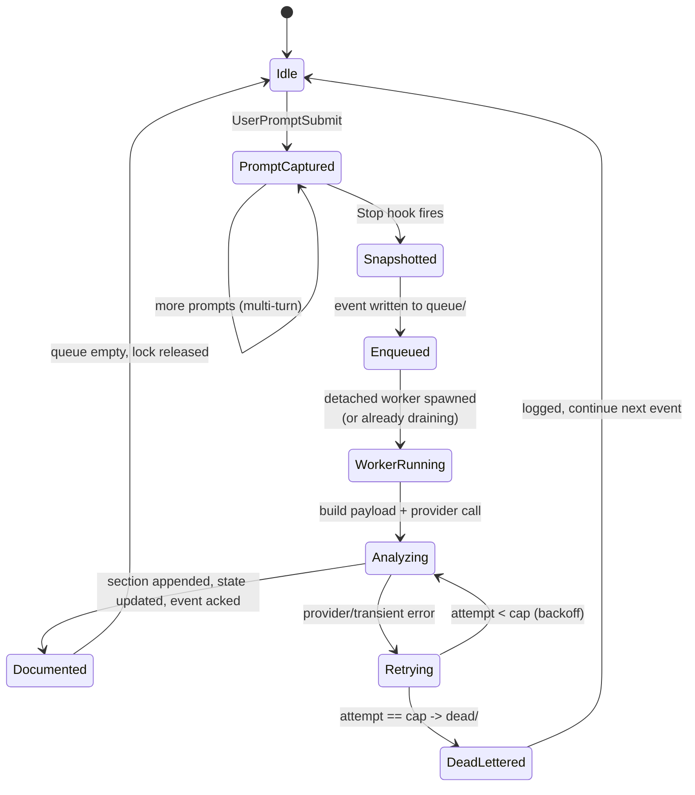

# AI Development Historian — Engineering Design Document

> ⚠️ **HISTORICAL (v1).** This describes the original *automatic, OpenCode-coupled*
> design with a queue/worker/spawn pipeline. The project was later refactored to
> be **manual and provider-agnostic** (auto hooks, worker, queue, and spawn were
> removed). For the **current** design see `README.md` (architecture + usage) and
> `REFACTOR_PLAN.md` (the v1→v2 refactor, phases R1–R7). Kept for history.

**Status:** Design (no implementation)
**Author role:** Principal Software Architect / AI Automation Engineer
**Implementer:** Claude Opus 4.8, phase by phase
**Target platform:** Windows first, cross-platform architecture
**Deployment model:** Per-project, local-only, opt-in

---

## 0. Purpose & Confirmed Decisions

**Problem.** Claude Code edits many files per iteration. The developer cannot easily see *what* changed, *why*, *how the architecture evolved*, and *what decisions were made* — and asking Claude to explain burns Claude's context and tokens.

**Solution.** An **AI Development Historian**: a small local automation that observes each Claude Code iteration, snapshots the exact file changes, and delegates all explanation/documentation work to **Gemini** (via its CLI). Gemini maintains an append-only `implementation.md` (one section per iteration) and, on demand, produces `PROJECT_ARCHITECTURE.md`, `KNOWLEDGE_BASE.md`, and `WORKFLOW.md`.

**Primary goal:** save Claude tokens/context by moving documentation work to a second model.

**Confirmed decisions (from the user):**

| Decision | Choice | Consequence |
|---|---|---|
| How to call the model | **OpenCode headless** (`opencode run -m opencode/nemotron-3-ultra-free`), invoked as a subprocess, payload on stdin | Gemini CLI login is **blocked** — the user's Gemini Pro works only in the GUI and is not authorized for CLI/API. OpenCode Zen is already authenticated and provides Nemotron free (cost 0). Provider seam makes this a one-file swap. Verified working (OpenCode v1.17.18). |
| Install scope | **Per-project, opt-in** via `historian init` | Hooks live in the *project's* `.claude/settings.json`. Only tracked repos fire. |
| Target repo | **Tool builds here AND documents itself** | Self-hosting from Phase 2; the historian is its own first test subject. |

**Verified environment facts:** folder currently empty, no git repo yet, Python 3.12.10 present, Gemini CLI **not** installed, Node.js status unknown (Phase 0 handles it).

---

## 1. High-Level Architecture

The system is **event-driven** but deliberately **not** a long-running service. Claude Code emits lifecycle events (hooks); each event triggers a short-lived Python process. Heavy work (Gemini calls) happens in a **detached background worker** so Claude is never blocked.

Three planes:

1. **Detection plane** — Claude Code hooks (`UserPromptSubmit`, `Stop`) call the historian CLI. Runs in-process with Claude, must be fast and must never fail loudly.
2. **Capture plane** — a **shadow git repository** records the precise file-level delta of each iteration, independent of the user's own git usage. A JSON-file **queue** holds pending iterations.
3. **Documentation plane** — a **detached worker** drains the queue, builds a payload, calls the **provider** (Gemini CLI), and appends to `implementation.md`. A manual **finalize** command produces the three summary documents.

Design tenets: stdlib-only Python (no pip installs), file-based state (no database, no daemon), provider-independent, and *fail-safe toward Claude* — a broken historian must degrade silently, never interrupt a coding session.



---

## 2. Component Diagram



**Boundaries.** `hooks.py` is the only code that runs synchronously inside Claude; it does the minimum (append a line / snapshot + enqueue + spawn) and returns. Everything expensive lives behind the detached `worker.py`. `providers/` is the only place that knows how to talk to an external model — swapping providers touches nothing else.

---

## 3. Sequence Diagram (one full iteration)

```mermaid
sequenceDiagram
    participant User
    participant Claude as Claude Code
    participant PH as hook prompt
    participant SH as hook stop
    participant SG as Shadow git
    participant Q as Queue
    participant W as Worker (detached)
    participant G as Gemini CLI
    participant IM as implementation.md

    User->>Claude: types prompt
    Claude->>PH: UserPromptSubmit (stdin JSON)
    PH->>Q: append prompt to session/prompts.jsonl
    PH-->>Claude: exit 0 (instant)

    Claude->>Claude: edits/creates/deletes files
    Claude->>SH: Stop (stdin JSON)
    SH->>SG: git add -A && commit -> new commit C_n
    SH->>Q: write event {iter, ts, prompts, C_{n-1}, C_n}
    SH->>W: spawn detached worker
    SH-->>Claude: exit 0 (fast; no Gemini call)

    Note over W: acquire worker.lock (single instance)
    W->>Q: read oldest event
    W->>SG: git diff C_{n-1}..C_n (+ name-status, diffstat)
    W->>W: render iteration.md template with payload
    W->>G: gemini -p  (payload on stdin)
    G-->>W: markdown analysis
    W->>IM: append "## Iteration N ..." (append-only)
    W->>Q: update state.json, delete event
    W->>W: loop until queue empty, then release lock
```

Key property: the two hook calls (`prompt`, `stop`) return in well under a second in the normal case; the Gemini round-trip (seconds) is fully off the critical path.

---

## 4. Data Flow Diagram



Secrets never enter the payload: exclude globs (`.env`, `*.pem`, `*.key`, etc.) are applied both to the shadow repo's excludes and to payload assembly.

---

## 5. Folder Structure

```
gemini/                                  # this project (tool + self-hosted target)
├── historian/                           # Python package — stdlib only, no pip deps
│   ├── __init__.py
│   ├── __main__.py                      # CLI dispatch: init|hook|worker|finalize|status
│   ├── config.py                        # load/write config.json, resolve paths, defaults
│   ├── log.py                           # rotating file logger factory
│   ├── hooks.py                         # fast-path handlers: prompt(), stop()
│   ├── shadowgit.py                     # thin wrappers over `git --git-dir=... --work-tree=...`
│   ├── collector.py                     # snapshot(), build_payload(), truncation
│   ├── queue.py                         # enqueue/read/ack event files, dead-letter
│   ├── worker.py                        # lockfile, drain loop, append section, state
│   ├── finalize.py                      # 3 summary docs
│   ├── spawn.py                         # cross-platform detached process spawn
│   ├── providers/
│   │   ├── __init__.py                  # get_provider(name) -> module
│   │   ├── opencode.py                  # PRIMARY: analyze(text) -> str via `opencode run` (stdin), tools denied
│   │   ├── gemini_cli.py                # ALTERNATIVE: `gemini -p` (needs a CLI-authorized key; currently blocked)
│   │   └── stub.py                      # deterministic fake, for tests/Phase 4
│   └── prompts/
│       ├── iteration.md                 # per-iteration analysis template
│       ├── architecture.md              # PROJECT_ARCHITECTURE template
│       ├── knowledge_base.md            # KNOWLEDGE_BASE template
│       └── workflow.md                  # WORKFLOW template
├── docs/                                # GENERATED output (committed to real git)
│   ├── implementation.md                # append-only iteration log
│   ├── PROJECT_ARCHITECTURE.md          # produced by finalize
│   ├── KNOWLEDGE_BASE.md                # produced by finalize
│   └── WORKFLOW.md                      # produced by finalize
├── .claude/
│   ├── settings.json                    # hook wiring (written by `historian init`)
│   └── commands/
│       └── historian-finalize.md        # /historian-finalize slash command
├── .historian/                          # RUNTIME state — gitignored
│   ├── config.json
│   ├── state.json                       # {iteration, last_shadow_commit, last_error}
│   ├── shadow.git/                      # bare-ish shadow repo (git-dir only)
│   ├── shadow.excludes                  # patterns the shadow repo ignores
│   ├── session/prompts.jsonl            # prompts captured since last Stop
│   ├── queue/                           # pending event-*.json
│   ├── dead/                            # events that exceeded retry cap
│   ├── worker.lock                      # single-instance guard
│   └── historian.log                    # rotating log
├── test_historian.py                    # single end-to-end smoke test (Phase 8)
├── DESIGN.md                            # THIS document
└── README.md
```

---

## 6. Module Responsibilities

| Module | Responsibility | Must NOT do |
|---|---|---|
| `__main__.py` | Parse argv, dispatch to a handler, translate exceptions to exit codes. Hook subcommands **always exit 0**. | Business logic. |
| `config.py` | Resolve project root, load/merge `config.json` with defaults, expose paths. | Talk to providers. |
| `log.py` | One rotating logger (`RotatingFileHandler`) writing `.historian/historian.log`. | Print to stdout during hooks (would pollute Claude). |
| `hooks.py` | `prompt()`: read stdin JSON, append prompt to `prompts.jsonl`. `stop()`: snapshot shadow commit, write queue event, spawn worker, return. | Call Gemini. Block. Raise to caller. |
| `shadowgit.py` | Init shadow repo; `add -A`; `commit`; `diff a..b`; `diff --name-status`; `diff --stat`; `rev-parse HEAD`. All via `--git-dir`/`--work-tree`. | Touch the user's real `.git`. |
| `collector.py` | `snapshot()` (used by stop hook) and `build_payload(event)` → dict of prompt/diff/name-status/diffstat with size caps + truncation fallback. | Persist state. |
| `queue.py` | Atomic enqueue (write temp + rename), ordered read (by iteration number), ack (delete), dead-letter after retry cap. | Long-lived locks. |
| `worker.py` | Acquire `worker.lock`; drain queue oldest-first; per event: build payload → provider → append section → update `state.json` → ack; retry with backoff; release lock. | Run more than one instance. Rewrite prior sections. |
| `finalize.py` | Assemble finalize input (implementation.md + file tree + capped excerpts), run 3 provider calls with the 3 templates, write the 3 docs. | Append to implementation.md. |
| `spawn.py` | `spawn_detached(argv)` — Windows `DETACHED_PROCESS|CREATE_NEW_PROCESS_GROUP`, POSIX `start_new_session=True`. | Wait on the child. |
| `providers/opencode.py` (**primary**) | `analyze(text) -> str`: run `opencode run -m opencode/nemotron-3-ultra-free`, feed `text` on **stdin**, return stdout; raise on non-zero. **Must set `OPENCODE_PERMISSION={"edit":"deny","bash":"deny","webfetch":"deny"}` in the subprocess env** so the agent does pure text-in/text-out and never touches the repo. Plain output format is clean; `--format json` + extract `type:"text"` parts is the robust fallback. Auth = existing OpenCode Zen credentials; cost 0. Verified (OpenCode v1.17.18). | Format prompts (that's templates). |
| `providers/gemini_cli.py` (alternative) | Same contract via `gemini -p` for if/when a CLI-authorized key exists. **Would need `GEMINI_CLI_TRUST_WORKSPACE=true` (or `--skip-trust`)** for headless. Currently unusable — Gemini Pro is GUI-only. | — |
| `providers/__init__.py` | `get_provider(name)` → import module by name from config. | Hardcode Gemini. |
| `prompts/*.md` | Instruction templates with `{placeholders}`. | Contain code. |

---

## 7. Technology Choices

| Concern | Choice | Why (ponytail rationale) |
|---|---|---|
| Language | **Python 3.12 (stdlib only)** | Already installed; `subprocess`, `json`, `pathlib`, `logging`, `argparse` cover everything. Zero pip installs to break. |
| Iteration detection | **Claude Code hooks** | Official, gives exact boundaries + prompt text. See §16 comparison. |
| Change capture | **Shadow git repo** (separate `--git-dir`) | Reuses git's own diff engine; independent of the user's commits; directly satisfies the `git diff/status/log/show` requirement. |
| Queue | **Directory of JSON files** | Durable across crashes, ordered, inspectable, no broker. A DB or message queue would be over-engineering. |
| Background execution | **Detached short-lived worker** | No Windows service, no daemon lifecycle. Spawned on demand, dies when queue empties. |
| Model access | **OpenCode headless via subprocess, stdin** (`opencode run`, free Nemotron) | Gemini CLI auth is blocked (Pro is GUI-only); OpenCode Zen is already authed and free. Stdin avoids Windows ~32 KB command-line limit for large diffs. Tools denied so the agent is a pure text transform. |
| Provider abstraction | **Module with `analyze(text)->str`** | Duck-typed; new provider = new file. No base class / registry / plugin loader. |
| Config | **Single `config.json`** | Human-readable, no secrets inside. |
| Docs format | **Markdown + Mermaid** | Renders in every viewer the user already uses. |

Explicitly **not** used: databases, async frameworks, message brokers, plugin systems, a base `Provider` ABC, per-module unit-test suites. One smoke test guards the end-to-end path.

---

## 8. Event Lifecycle



**Lifecycle rules.**
- A `Stop` with an empty shadow diff (Claude made no file changes) is recorded as a no-op iteration and skipped — no Gemini call, no section (configurable).
- If a worker is already draining when a new `Stop` arrives, the second spawn attempt sees the lock, logs "already running", and exits; the new event is picked up by the running loop. No double processing.
- Prompts accumulate in `prompts.jsonl` between Stops and are attached to the event, then the session prompt file is rolled so the next iteration starts clean.

---

## 9. Failure Handling

Guiding rule: **the historian must never break Claude, and must never lose an iteration silently.**

| Failure | Handling |
|---|---|
| Any exception in a **hook** | Caught at the top of `__main__` for `hook` subcommands; logged; **exit 0**. Claude proceeds unaffected. |
| `git` missing / shadow repo corrupt | Stop hook logs and exits 0; no event enqueued (documented as a known gap in `status`). |
| **Gemini CLI missing / not authed / non-zero exit** | Worker marks event failed, increments retry count, backs off (e.g. 2s, 8s, 30s). After cap (default 3) → move to `dead/`, log, continue. |
| Gemini timeout | Subprocess run with a timeout; treated as a transient failure (retry). |
| Payload too large | `collector` truncation fallback (§13) keeps the call within limits rather than failing. |
| Worker crash mid-event | Event was not acked (still in `queue/`); next `Stop` respawns worker; it re-processes from the un-acked event. Appends are guarded to avoid a duplicate section (state records last completed iteration). |
| Two workers race | `worker.lock` (atomic create; PID + timestamp). Stale lock (PID dead or older than TTL) is reclaimed. |
| Corrupt event JSON | Moved straight to `dead/`, logged. |
| `implementation.md` write fails | Event stays un-acked; retried. Append uses write-to-temp + append pattern to avoid partial sections. |

`dead/` is the human-review bucket; `historian status` surfaces its count and the last error so failures are visible without reading logs.

---

## 10. Logging Strategy

- **Single rotating log**: `.historian/historian.log` via `logging.handlers.RotatingFileHandler` (e.g. 1 MB × 3 backups). Configurable level (default `INFO`).
- **Hooks log tersely** and **never write to stdout/stderr** in the success path (stdout in a hook can be interpreted by Claude Code; keep it clean). Errors go to the log file only.
- **Worker logs** each event: start, payload size, provider duration, outcome, retries.
- **Correlation**: every log line carries the iteration number so a session can be traced end to end.
- **`historian status`** is the operator's dashboard: current iteration, queue depth, dead-letter count, last successful iteration + timestamp, last error string. No log-grepping required for normal use.

---

## 11. Configuration Management

`.historian/config.json` (created by `init`, editable by hand):

```jsonc
{
  "provider": "opencode",              // primary; "gemini_cli" once a CLI key exists
  "model": "opencode/nemotron-3-ultra-free",  // provider/model for opencode run -m
  "opencode_command": "opencode",      // override path/name if needed
  "opencode_deny_tools": true,         // sets OPENCODE_PERMISSION to deny edit/bash/webfetch
  "docs_dir": "docs",
  "implementation_file": "implementation.md",
  "diff_cap_bytes": 200000,            // payload diff budget before truncation
  "provider_timeout_sec": 180,
  "retry_cap": 3,
  "skip_empty_iterations": true,
  "exclude_globs": [                   // never captured / never sent
    ".historian/", ".git/", "node_modules/", "dist/", "build/",
    "*.env", ".env*", "*.pem", "*.key", "*.pfx", "*.log"
  ]
}
```

- **No secrets in config.** Gemini auth is the CLI's own concern (`GEMINI_API_KEY` env var or `gemini` login). The historian just invokes the command.
- **Defaults live in `config.py`**; the file only needs to override what differs. Missing keys fall back to defaults, so an old config keeps working after upgrades.
- **Paths** are resolved relative to the project root (the directory containing `.historian/`), so the tool is location-independent.

---

## 12. Extensibility Strategy

- **New model provider** → add `providers/<name>.py` exposing `analyze(text: str) -> str`, set `"provider": "<name>"`. No other file changes. (Gemini today; Claude/OpenAI/local Ollama later.)
- **New document type** → add a template in `prompts/` and a call in `finalize.py`.
- **Change per-iteration content** → edit `prompts/iteration.md` only; no code change.
- **New captured signal** (e.g. test output, lint results) → extend `collector.build_payload()` to include it and reference it in the template. The plan reserves an optional `terminal_output` field for this.
- **Different detection source** → because hooks only call `historian hook stop`, an alternate trigger (git hook, manual `historian iterate`) can reuse the entire capture/doc pipeline unchanged.

The abstraction line is drawn at exactly one seam (the provider function) because that is the only axis the user said will vary. No speculative interfaces elsewhere.

---

## 13. Security Considerations

- **Local by default.** Only two things leave the machine: the prompt text and the diff, sent to Gemini. Everything else stays on disk.
- **Secret exclusion.** `exclude_globs` filters both shadow-repo tracking and payload assembly so `.env`, keys, and certs are neither committed to the shadow repo nor sent to Gemini. This is applied at capture time, not just at send time.
- **No secrets in historian files.** Auth is delegated to the Gemini CLI's own credential store / env var.
- **Shadow repo isolation.** The shadow repo uses its own `--git-dir`; it cannot alter the user's real git history or index.
- **Prompt-injection awareness.** Diffs may contain adversarial text; Gemini output is treated as *documentation only* and written to markdown — never executed, never used to drive further commands.
- **Data residency note (README).** Users should know diffs go to Google's Gemini service; the exclude list is their control surface. Sensitive repos can point `provider` at a local model later with zero architecture change.

---

## 14. Performance Considerations

- **Hook latency is the only user-visible cost.** `prompt` is a single file append. `stop` is `git add -A` + `commit` + one small JSON write + a non-blocking spawn — sub-second on typical repos.
- **Gemini calls are fully async** in the detached worker; the user keeps coding while docs are generated.
- **Large repos:** `git add -A` scales with changed files, not repo size, and git's diff is fast. The **diff cap + truncation fallback** bounds payloads: when a diff exceeds `diff_cap_bytes`, the payload keeps the full `--stat` summary plus a head of each file's hunk and notes the truncation, so Gemini still gets structure without a megabyte of noise.
- **Finalize:** feeds `implementation.md` (already summarized, compact) plus a file tree and capped source excerpts rather than the entire codebase, keeping it within context even for big projects. Gemini Pro's large context window absorbs typical projects directly.
- **Queue drain is sequential** (ordering matters for append-only docs), but iterations are far apart in wall-clock time, so throughput is a non-issue; correctness/order beats parallelism here.

---

## 15. Future Enhancements

- **Terminal/test output capture** into the payload (field already reserved).
- **Diff of docs themselves** — let Gemini flag when an iteration contradicts an earlier documented decision.
- **HTML/site export** of the docs (e.g. a static viewer) — out of scope now.
- **Multi-provider consensus** (Gemini + another model) for higher-stakes finalize docs.
- **Incremental finalize** — regenerate only the sections affected by recent iterations.
- **`historian undo`** — since every iteration is a shadow commit, offer a read-only "show me iteration N's exact diff" browser.
- **Cross-repo digest** — weekly summary across several tracked projects.

These are listed to bound scope, not to build now (YAGNI).

---

## 16. Approach Comparison & Development Roadmap

### 16a. Approaches evaluated

| Approach | Pros | Cons | Verdict |
|---|---|---|---|
| **Claude Code hooks** (`UserPromptSubmit` + `Stop`) | Exact iteration boundaries; prompt text delivered as stdin JSON; official, supported mechanism; zero polling; per-project opt-in fits the requirement. | Requires Claude Code; hook must be fast and fail-safe. | **CHOSEN.** Only approach that knows both "an iteration happened" and "what the prompt was." |
| **Git hooks** (`post-commit`) | Simple; language-agnostic. | Fires on *commit*, but Claude doesn't commit per iteration — wrong boundary; no access to the user prompt; pollutes the user's real repo config. | Rejected (used internally as the *shadow* mechanism, not as the trigger). |
| **Filesystem watcher** | No Claude dependency. | No iteration boundary (can't tell "Claude finished" from "file saved"); debounce complexity; no prompt text; noisy. | Rejected. |
| **Always-on background service** | Central, always ready. | Windows service lifecycle complexity; overkill; still needs a trigger. | Rejected — a detached per-event worker gives the same benefit with none of the lifecycle burden. |
| **CLI wrapper around `claude`** | Full control of I/O. | Fragile; breaks the interactive TUI; unofficial; high maintenance. | Rejected. |
| **Python orchestrator driving Claude (SDK)** | Total control of the loop. | Changes the user's workflow; the user wants to keep using Claude Code normally. | Rejected. |
| **Event-driven, file-queue + detached worker** (chosen runtime) | Durable, crash-safe, no broker, inspectable, async. | Sequential throughput (fine here). | **CHOSEN** as the runtime shape behind the hooks. |

**Recommended architecture:** Claude Code hooks for detection → shadow git for capture → file queue + detached worker for async processing → pluggable provider (Gemini CLI) for documentation. This is the minimum machinery that meets every requirement while keeping Claude fast and the historian replaceable.

### 16b. Development Roadmap (each phase: independently buildable, testable, committable)

Every phase ends with a git commit. Self-hosting turns on at Phase 2, so from then on the historian documents its own construction.

---

**Phase 0 — Prerequisites & bootstrap**
- **Goal:** working toolchain.
- **Do:** confirm OpenCode installed + OpenCode Zen authed (`opencode auth list`); `git init` this repo; create `.gitignore` with `.historian/`. (Gemini CLI path deferred — Pro is GUI-only.)
- **Files:** `.gitignore`.
- **Test:** `"reply with OK" | opencode run -m opencode/nemotron-3-ultra-free` returns text (verified); `git status` clean-ish.
- **Commit:** "chore: toolchain + gitignore".

**Phase 1 — Package scaffold + `init`**
- **Goal:** `python -m historian init` sets up a project.
- **Do:** create `historian/` package, `__main__.py` dispatch, `config.py`, `log.py`, `shadowgit.py` (init only), `spawn.py` (stub). `init` creates `.historian/` (config, state, shadow repo + `shadow.excludes`), writes `.claude/settings.json` hooks and appends to `.gitignore`. Idempotent.
- **Files:** `historian/__init__.py`, `__main__.py`, `config.py`, `log.py`, `shadowgit.py`, `spawn.py`, `.claude/settings.json`.
- **Test:** run `init` twice → no error, no duplicate hooks; `.historian/shadow.git` exists; a manual shadow `add`/`commit` works.
- **Commit:** "feat: package scaffold + historian init".

**Phase 2 — Hook fast path (enable self-hosting)**
- **Goal:** hooks capture prompts and snapshot iterations (no worker/Gemini yet).
- **Do:** `hooks.prompt()` (read stdin JSON → append to `prompts.jsonl`), `hooks.stop()` (shadow snapshot → write queue event → **no** worker spawn yet). Wire both to always exit 0.
- **Files:** `historian/hooks.py`, `queue.py`, `collector.snapshot()`.
- **Test:** run a real Claude iteration in this repo → assert `prompts.jsonl` has the prompt, `queue/` has one event, shadow repo has a new commit. **Turn on self-hosting.**
- **Commit:** "feat: hook fast path + shadow snapshots".

**Phase 3 — Collector payload builder**
- **Goal:** turn an event into a Gemini-ready payload.
- **Do:** `collector.build_payload(event)` → prompt(s), `git diff a..b`, `--name-status` (M/A/D lists), `--stat`, with `diff_cap_bytes` + truncation fallback.
- **Files:** `historian/collector.py`, `shadowgit.py` (diff functions).
- **Test:** script create/modify/delete across two shadow commits → assert payload lists the right files in the right buckets and respects the cap.
- **Commit:** "feat: collector payload + truncation".

**Phase 4 — Worker with stub provider**
- **Goal:** async pipeline end to end, no real model.
- **Do:** `spawn.spawn_detached`, `worker.py` (lockfile, drain oldest-first, append section, update `state.json`, ack, dead-letter), `providers/stub.py`. Wire `hooks.stop()` to spawn the worker.
- **Files:** `historian/worker.py`, `spawn.py`, `providers/__init__.py`, `providers/stub.py`.
- **Test:** enqueue 3 fake events → `implementation.md` gets 3 ordered sections; kill/relaunch mid-drain → no dupes, backlog completes.
- **Commit:** "feat: detached worker + stub provider".

**Phase 5 — OpenCode provider + iteration template**
- **Goal:** real documentation per iteration.
- **Do:** `providers/opencode.py` (`analyze` via `opencode run -m <model>`, stdin, `OPENCODE_PERMISSION` denying tools, timeout, non-zero → raise), `prompts/iteration.md` (all required fields, senior-engineer voice), retry/backoff in worker.
- **Files:** `historian/providers/opencode.py`, `prompts/iteration.md`.
- **Test:** one real iteration → `implementation.md` section contains every required field, reads like an engineer explaining to a peer (check Nemotron doesn't slip into agent/tool chatter — tighten prompt or use a minimal `--agent` if it does).
- **Commit:** "feat: opencode provider + iteration analysis".

**Phase 6 — Robustness**
- **Goal:** safe under failure and visible.
- **Do:** rotating log wiring, `historian status`, secret-exclude enforcement at capture + payload, truncation edge cases, retry cap → dead-letter, stale-lock reclaim.
- **Files:** `historian/log.py`, `worker.py`, `collector.py`, `__main__.py` (status).
- **Test:** kill worker mid-run → next Stop drains backlog; break Gemini (bad command) → event lands in `dead/`, `status` shows it, Claude unaffected.
- **Commit:** "feat: robustness, status, secret exclusion".

**Phase 7 — Finalize + slash command**
- **Goal:** the three summary documents.
- **Do:** `finalize.py` (assemble input, 3 provider calls), `prompts/architecture.md` (Mermaid), `knowledge_base.md`, `workflow.md`; `historian finalize`; `.claude/commands/historian-finalize.md`.
- **Files:** `historian/finalize.py`, `prompts/architecture.md|knowledge_base.md|workflow.md`, `.claude/commands/historian-finalize.md`.
- **Test:** `historian finalize` (or `/historian-finalize`) → all three docs generated, Mermaid blocks parse.
- **Commit:** "feat: finalize docs + slash command".

**Phase 8 — Polish**
- **Goal:** ship-ready.
- **Do:** `README.md` (setup, data-residency note, config reference), `test_historian.py` (one end-to-end smoke test with the stub provider), POSIX spawn path verified, cross-platform notes.
- **Files:** `README.md`, `test_historian.py`.
- **Test:** `python test_historian.py` green on a clean checkout.
- **Commit:** "docs: readme + smoke test + cross-platform".

---

### Verification (whole system)

1. `historian init` in a fresh repo → hooks wired, shadow repo live.
2. Run several Claude iterations → each appends a correct, complete section to `docs/implementation.md`, and Claude never stalls.
3. Induce a provider failure → iteration dead-letters, `historian status` reports it, Claude session is unaffected.
4. `historian finalize` → `PROJECT_ARCHITECTURE.md`, `KNOWLEDGE_BASE.md`, `WORKFLOW.md` generated with valid Mermaid.
5. Confirm no secret-matching files appear in the shadow repo or in any payload sent to Gemini.

